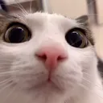

    
    <h1>Flask Multi Tool Web App</h1>
    
Currently supports converting image files and merging audio and video files. The only requirement is: FFmpeg. Make sure it's in your PATH.

    
There is an easter egg for you to discover :3

    <h2>Repositories used in this project</h2>
    <a href="https://github.com/vorlie/python-ffmpeg-audio-video-merger-gui">vorlie/python-ffmpeg-audio-video-merger-gui</a>
     
    <a href="https://github.com/vorlie/ImageFormatConverter">vorlie/ImageFormatConverter</a>

